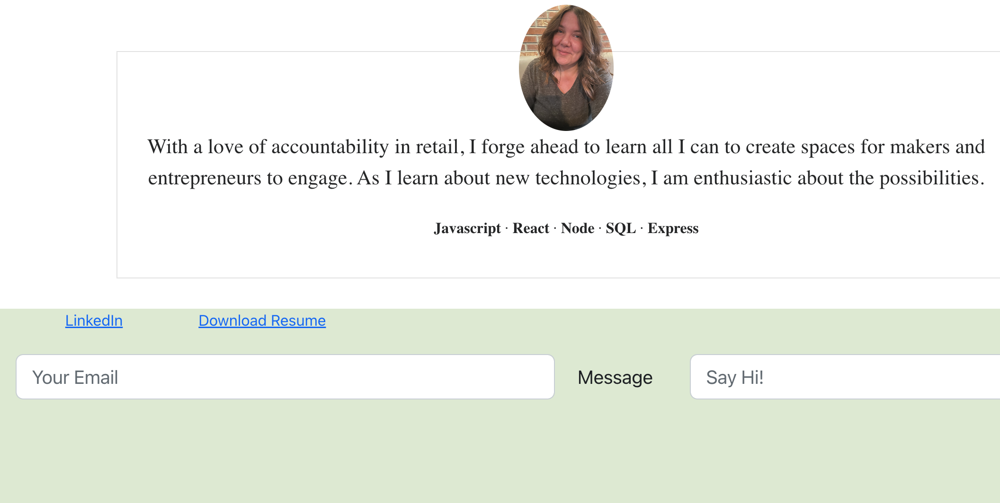
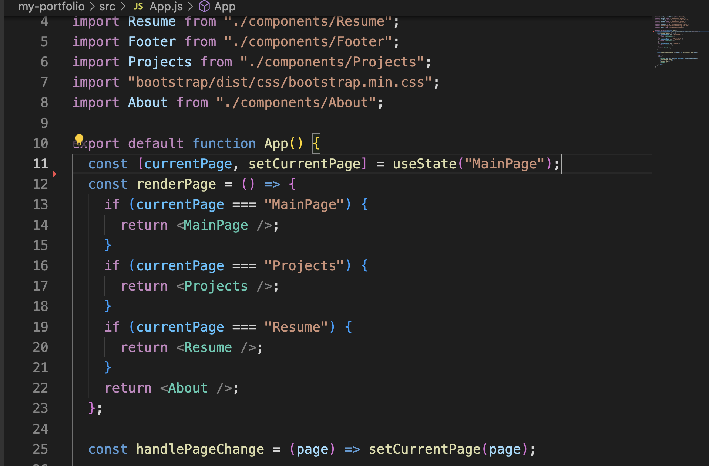
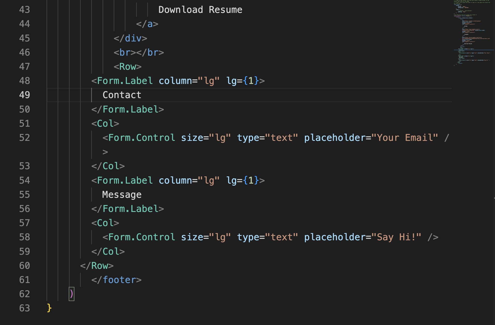

# Using React to Create a Single Page App

*****
  

## Description
Using GitHub's page deploy for React,  I was able to create a interactive single page application. While I leaned again on Bootstrap for my styling, I believe that with a few minor tweaks it will work perfectly to show off my accomplishments. 
***

***
I would like the complete contact form to be in the footer. This will leave it present on all pages to reach out and contact me. So while I know the criteria called for a separate page for a contact form, I felt that the UI would benefit having access to this on every page. 
***
My deployed page:
[Lindsay Allen Portfolio](https://katsaymeow.github.io/Lindsay-Allen-Portfolio-React/)
***
## Table of Contents
- [Description](#description)
- [Installation](#installation)
- [Usage](#usage)
- [License](#license)
- [Contributing](#contributing)
- [Tests](#tests)
- [Questions](#questions)
- [Sources](#sources)

*****

## Installation
`npm create-react-app`  
`npm install`  
After these processes, I was able to add npm packages for my additional functions. 
***

*****
## Usage
To function as a showcase for my development projects
***

*****
## License

[MIT](https://tlo.mit.edu/learn-about-intellectual-property/software-and-open-source-licensing)

This application is covered by the MIT license. 
*****
## Contributing
Lindsay Allen
*****
## Tests
Yes, but the default React App test
*****
## Questions
Please submit a pull request with all issues
*****
## Sources
My life.
*****

Find me on GitHub: [katsaymeow](https://github.com/katsaymeow)

Email me with any questions: allenlindsay@gmail.com

    

